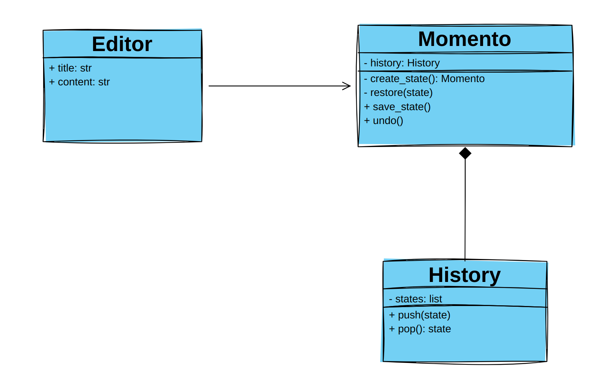

# Design Patterns in Python

## Behavioural Design Patterns
Behavioral design patterns are concerned with algorithms and the assignment of **responsibilities between objects**.

### Momento
Lets you save and restore the previous state of an object without revealing the details of its implementation.

